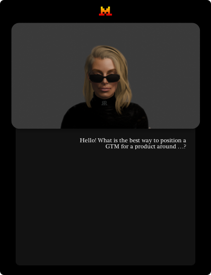

# Sis
A Mac App for Mistral, MLX or APIs.

**A digital sister**: a warm, intuitive, emotionally intelligent presence that blends the best of a confidante, a hype-woman, and a creative muse.

### Mistral’s Brain + Sister Soul
| Feature           | How It Works                             | Example                                                                        |
|-------------------|------------------------------------------|--------------------------------------------------------------------------------|
| Contextual Memory | Tracks your habits, preferences, traumas | "Last time you worked late, you regretted it. Want me to set a hard stop?"     |
| Proactive Care    | Anticipates needs                        | "You’re behind on texts. Here’s 3 drafts—pick one or I’ll send the sassy one." |
| Creative Pushback | Challenges you                           | "This logo is safe. Want to try this instead?" (shows a wild alternative.)     |
| Defensive Mode    | Protects your energy                     | "This meeting invite has no agenda. I auto-declined."                          |
